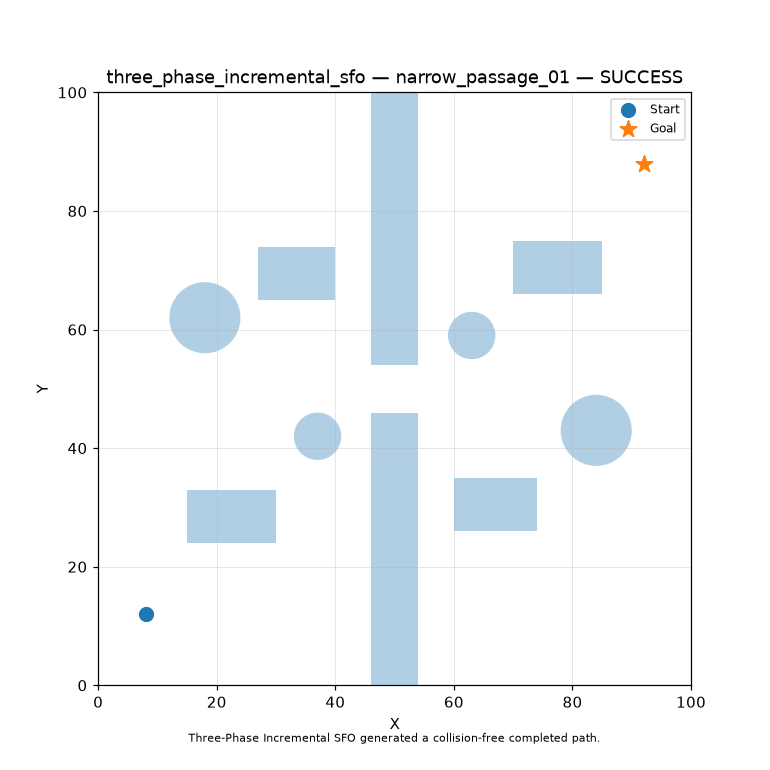
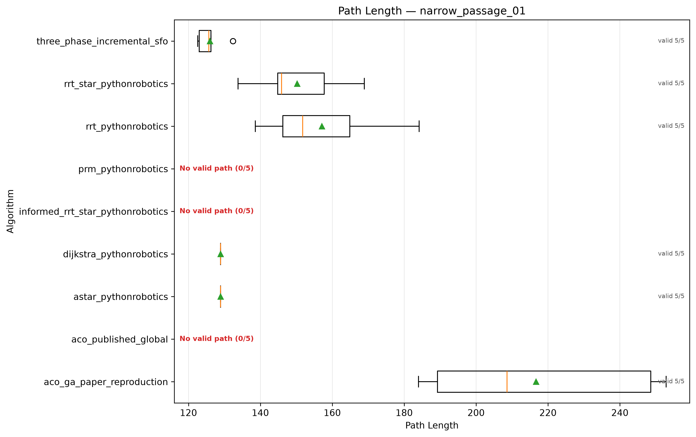

# SFO Path Planning

**A reproducible benchmark for static global robot path planning with a Three-Phase Incremental SFO planner.**

[](https://www.python.org/)
[](https://www.mathworks.com/)
[](LICENSE)
[](docs/EXPERIMENT_SETUP.md)

<p align="center">
  
</p>

<p align="center"><em>Example successful trajectory: Three-Phase Incremental SFO on the narrow-passage map (Run 1).</em></p>

## Overview

This repository provides the implementation and experimental framework for evaluating a **Three-Phase Incremental SFO** method for two-dimensional, static, global path planning. The framework is designed for transparent comparison: every run saves its trajectory, performance metrics, convergence trace, static figure, and animated diagnostic.

The benchmark evaluates path quality, safety, planning time, and success rate across three maps with increasing structural difficulty: dense obstacles, a narrow passage, and a bug-trap configuration.

### Research principles

- **Native implementations are preserved.** Each reference planner retains its original solution representation, internal objective function, and source-specific parameters.
- **Post-run evaluation is consistent.** Physical performance metrics are calculated after planning using a common environment and collision-validation layer.
- **Failures remain visible.** Partial and invalid trajectories are retained as diagnostic artefacts rather than discarded.
- **Reproducible configuration.** Maps, random seeds, planner parameters, and reporting rules are defined in version-controlled configuration files.

## Benchmark suite

| Planner family | Methods |
|---|---|
| Grid search | A*, Dijkstra |
| Sampling-based | RRT, RRT*, Informed RRT*, PRM |
| Swarm intelligence | ACO |
| Hybrid metaheuristic | ACO-GA |
| Proposed method | Three-Phase Incremental SFO |

The suite covers three `100 × 100` static maps and uses five independent runs for each planner–map pair. The default protocol therefore schedules **135 runs**.

## Results at a glance

The table below summarises the reported performance of the proposed planner across five independent runs per map. Path-quality values are calculated **only from valid, collision-free paths that reach the goal**; success rate is calculated from all attempts.

| Map | Valid runs | Mean path length | Mean turning angle | Mean planning time |
|---|---:|---:|---:|---:|
| Dense obstacles | 5 / 5 | 134.70 ± 5.96 | 0.72 ± 0.19 rad | 167.53 ± 58.10 s |
| Narrow passage | 5 / 5 | 125.98 ± 3.93 | 2.92 ± 0.89 rad | 147.07 ± 66.46 s |
| Bug trap | 5 / 5 | 142.70 ± 6.66 | 4.03 ± 0.10 rad | 290.12 ± 37.13 s |

On the narrow-passage map, the proposed method achieved a mean path length of **125.98** over five valid runs. The figure below shows the complete path-length distribution for the reference planners and the proposed method; methods without a valid path are explicitly marked rather than omitted.

<p align="center">
  
</p>

<p align="center"><em>Path-length distribution on the narrow-passage map. Boxplots use valid runs only; failure counts remain visible.</em></p>

Complete run-level records, figures, statistical tests, and reporting logic are generated by the benchmark workflow and described in the documentation below.

## Repository structure

```text
configs/       Experiment and validation settings
docs/          Experimental protocol, architecture, and source traceability
experiments/   Benchmark and figure-generation entry points
src/           Planner implementations and evaluation framework
tests/         Automated tests
third_party/   Preserved external reference implementations and notices
assets/        README visual assets
```

## Requirements

- Windows PowerShell
- Python 3.11
- MATLAB R2025 or GNU Octave only for the ACO-GA reference implementation

## Installation

```powershell
py -3.11 -m venv .venv
& ".\.venv\Scripts\python.exe" -m pip install --upgrade pip setuptools wheel
& ".\.venv\Scripts\python.exe" -m pip install -e ".[dev]"
```

If MATLAB is not available on `PATH`, define its executable before running an ACO-GA workflow:

```powershell
$env:SFO_MATLAB_EXECUTABLE = "C:/Program Files/MATLAB/R2025a/bin/matlab.exe"
```

## Run validation

```powershell
.\run_validation.ps1
```

The validation workflow runs the Python test suite, source-specific ACO checks, the ACO-GA reproduction self-test, and ACO-GA map validation.

## Run the benchmark

```powershell
.\run_benchmark.ps1
```

The default configuration is [`configs/benchmark.yaml`](configs/benchmark.yaml). Outputs are saved under:

```text
results/experiments/static_benchmark/
```

Each run includes a trajectory, planner state, configuration snapshot, metrics, convergence figure, static path plot, and animated diagnostic. Aggregate tables include descriptive statistics, success rates, Friedman tests, and Holm-adjusted pairwise tests.

## Documentation

- [Experimental setup](docs/EXPERIMENT_SETUP.md) — protocol, maps, and parameter tables.
- [LaTeX experimental setup](docs/EXPERIMENT_SETUP.tex) — paper-ready version of the protocol.
- [Architecture](docs/ARCHITECTURE.md) — package design.
- [SFO method](docs/THREE_PHASE_INCREMENTAL_SFO.md) — proposed planner summary.
- [ACO source traceability](docs/ACO_HAGHRAH_TRACEABILITY.md) and [ACO-GA traceability](docs/ACO_GA_PAPER_TRACEABILITY.md).
- [Third-party notices](docs/THIRD_PARTY_NOTICES.md).

## Citation and archival record

Citation metadata is included in [`CITATION.cff`](CITATION.cff) and Zenodo metadata is included in [`.zenodo.json`](.zenodo.json). The repository is configured for Zenodo archival; the DOI will be added after Zenodo processes the first GitHub release.

## License

The project code in this repository is released under the [MIT License](LICENSE). Third-party components retain their original licenses and provenance; see [Third-Party Notices](docs/THIRD_PARTY_NOTICES.md).
